# Pipeline architektury SmartBuildSim

## Kluczowe komponenty

- **Generator danych** – `DataGeneratorConfig` kontroluje kroki czasowe, trendy, anomalie i normalizację, a `generate_and_save` zapisuje wynikowe ramki danych na dysk.【F:src/smartbuildsim/data/generator.py†L23-L204】【F:src/smartbuildsim/data/generator.py†L374-L401】
- **Konfiguracja i deterministyczność** – `DeterminismConfig` i `configure_determinism` zapewniają spójne ziarna dla wszystkich modułów, natomiast `load_yaml` i `apply_overrides` wczytują pliki YAML oraz nadpisania przekazane z CLI.【F:src/smartbuildsim/config/determinism.py†L13-L128】【F:src/smartbuildsim/utils/helpers.py†L27-L71】
- **Moduły modeli** – funkcje `train_forecasting_model`, `detect_anomalies`, `cluster_zones` i `train_policy` wykorzystują dane wejściowe i konfiguracje Pydantic do uczenia prognoz, detekcji anomalii, klastrowania oraz sterowania RL.【F:src/smartbuildsim/models/forecasting.py†L21-L137】【F:src/smartbuildsim/models/anomaly.py†L16-L64】【F:src/smartbuildsim/models/clustering.py†L13-L76】【F:src/smartbuildsim/models/rl.py†L13-L123】
- **CLI i API** – aplikacja Typer (`smartbuildsim.cli.app`) integruje ładowanie scenariuszy, deterministykę, generowanie danych oraz modele; ten sam przepływ jest dostępny z poziomu Pythona przez `examples/scripts/run_example.py`.【F:src/smartbuildsim/cli/app.py†L1-L210】【F:examples/scripts/run_example.py†L1-L68】
- **Warstwa storage** – ramki danych i artefakty trafiają do katalogów wyznaczonych w konfiguracji dzięki `ensure_directory`, `save_dataset`, `persist_model` oraz funkcjom wizualizacji zapisującym pliki graficzne.【F:src/smartbuildsim/utils/helpers.py†L20-L44】【F:src/smartbuildsim/data/generator.py†L364-L386】【F:src/smartbuildsim/models/forecasting.py†L114-L128】【F:src/smartbuildsim/viz/plots.py†L24-L67】

## Diagram przepływu

```mermaid
flowchart LR
    subgraph Konfiguracja
        YAML[YAML + overrides]
        Determinism[DeterminismConfig]
    end
    CLI[CLI Typer<br/>`smartbuildsim.cli`]:::cli
    Scenario[Scenariusze<br/>`scenarios.presets`]:::config
    BIM[BIM schema<br/>`bim.schema`]:::config
    Generator[Generator danych<br/>`data.generator`]:::data
    Dataset[(Dataset CSV/Pandas)]:::data
    Features[Feature engineering<br/>`features.engineering`]:::features
    Models{{Modele<br/>forecast/anomaly/<br/>clustering/RL}}:::models
    Viz[Wizualizacje<br/>`viz.plots`]:::viz
    Storage[(Katalog outputs<br/>artefakty .csv/.joblib/.png)]:::storage

    YAML --> CLI
    Determinism --> CLI
    CLI --> Scenario
    Scenario --> BIM
    CLI --> BIM
    BIM --> Generator
    CLI --> Generator
    Generator --> Dataset
    Dataset --> Storage
    Dataset --> Features
    Features --> Models
    Models --> Storage
    Models --> Viz
    Viz --> Storage
    CLI --> Storage

    classDef cli fill:#f2f0ff,stroke:#4c3bcf;
    classDef config fill:#e6f4ff,stroke:#1a73e8;
    classDef data fill:#e8f5e9,stroke:#0b8043;
    classDef features fill:#fff3e0,stroke:#fb8c00;
    classDef models fill:#fdecef,stroke:#c2185b;
    classDef viz fill:#f3e5f5,stroke:#8e24aa;
    classDef storage fill:#eceff1,stroke:#546e7a;
```

## Opis etapów

1. **Wejście konfiguracyjne** – użytkownik wskazuje plik YAML oraz nadpisania (`--override`), które są łączone i wczytywane wraz z ustawieniami deterministycznymi, aby każdy komponent otrzymał stabilne nasiona losowe.【F:src/smartbuildsim/cli/app.py†L39-L110】【F:src/smartbuildsim/utils/helpers.py†L27-L71】【F:src/smartbuildsim/config/determinism.py†L13-L128】
2. **Scenariusz i BIM** – CLI może pobrać gotowy scenariusz (`Scenario`) lub schemat BIM z dysku, a następnie udostępnić je generatorowi danych i modułom modeli w spójnej strukturze.【F:src/smartbuildsim/cli/app.py†L98-L158】【F:src/smartbuildsim/scenarios/presets.py†L15-L175】
3. **Generowanie danych** – `generate_and_save` tworzy deterministyczny zbiór danych w oparciu o opis budynku, konfigurację generatora i parametry anomalii, zapisując wynik do CSV oraz metadane normalizacji w atrybutach ramki.【F:src/smartbuildsim/data/generator.py†L23-L337】【F:src/smartbuildsim/data/generator.py†L374-L401】
4. **Feature engineering** – moduł `features.engineering` przygotowuje sygnały pochodne (średnie kroczące, odchylenia, pochodne) oraz macierze nadzorowane dla modeli prognozujących.【F:src/smartbuildsim/features/engineering.py†L11-L53】
5. **Modelowanie i ewaluacja** – konfiguracje modeli sterują treningiem regresji (prognoza), IsolationForest (anomalia), KMeans (klastry) i Q-learningu (RL), każdorazowo zwracając wyniki wraz z metrykami lub artefaktami do ponownego użycia.【F:src/smartbuildsim/models/forecasting.py†L21-L137】【F:src/smartbuildsim/models/anomaly.py†L16-L64】【F:src/smartbuildsim/models/clustering.py†L13-L76】【F:src/smartbuildsim/models/rl.py†L13-L123】
6. **Utrwalenie i raportowanie** – dane i modele trafiają do katalogów zdefiniowanych w konfiguracji, a funkcje takie jak `persist_model`, `plot_time_series` czy zapis CSV w przykładzie API dostarczają gotowe raporty i wizualizacje do dalszej analizy.【F:src/smartbuildsim/models/forecasting.py†L114-L128】【F:src/smartbuildsim/viz/plots.py†L24-L67】【F:examples/scripts/run_example.py†L21-L65】

Diagram odzwierciedla pełny przepływ danych oraz punkty, w których można wstrzykiwać własne konfiguracje lub zastępować komponenty (np. niestandardowy storage albo moduły modeli), zachowując deterministyczność całego procesu.
